# The Walking Dead: 22 Domains
## A Technical Case Study in Persistent Malware Remediation & Infrastructure Hardening

---

## Executive Summary

In mid-2025, a sophisticated botnet infection was identified across **22 WordPress and Static sites** on shared hosting infrastructure. The attack leveraged advanced persistence mechanisms—**Linux Immutable Attributes** (`chattr +i`) combined with self-healing **Guardian watchdog scripts**—to achieve kernel-level file locking that resisted standard deletion.

This project documents the complete incident lifecycle: **identification → reverse-engineering → 100% eradication → hardened zero-trust baseline**.

**Outcome:** Zero reinfection; all persistence mechanisms eliminated; infrastructure hardened against similar attacks.

---

## Incident Overview

| Aspect | Status | Technical Detail |
|--------|--------|------------------|
| **Severity** | Critical | Full filesystem lockout + lateral movement across 22 domains |
| **Infection Type** | Zombie Botnet | High-persistence, self-healing PHP malware with kernel-level locks |
| **Initial Entry** | Vulnerable Plugin | Outdated WordPress plugin/library on patient-zero domain |
| **Attack Scope** | 22 Domains | Cross-site contamination via shared hosting permissions |
| **Eradication Rate** | 100% | Complete removal of backdoors, Guardian scripts, and immutable bits |
---

## Incident Response Workflow

```mermaid
graph TD
    A[🚨 User Reports Slow Website] -->|Trigger| B(🔍 Investigation Phase)
    B --> C{Is Malware Found?}
    C -- Yes --> D[🦠 Identify: PHP Backdoor]
    C -- No --> E[Monitor Metrics]
    
    D --> F[🛡️ Containment Phase]
    F --> G[Disconnect Public Internet]
    F --> H[Apply Network Policy: Deny All]
    
    H --> I[🧹 Eradication Phase]
    I --> J[Kill Malicious Process]
    I --> K[Remove Infected Files]
    
    K --> L[♻️ Recovery Phase]
    L --> M[Restore Data from Backup]
    M --> N[🚀 Deploy Immutable Infrastructure]
    
    style D fill:#f96,stroke:#333,stroke-width:2px
    style N fill:#9f6,stroke:#333,stroke-width:2px
```



---

## The Threat: "Zombie" Persistence Mechanisms

The malware employed **two advanced persistence techniques** that defeated standard removal:

### 1. Immutable Locking (`chattr +i`)
Files were locked at the **kernel level** using Linux immutable attributes, rendering standard deletion commands useless—even for root:
```
----i----------C------ malware.php  # Immutable bit set
```
Standard `rm -rf` failed with: `Operation not permitted`

### 2. Guardian Watchdog Scripts
Self-healing PHP scripts monitored critical files (`index.php`, `.htaccess`). On deletion/modification, the Guardian automatically re-wrote malicious code, creating an infinite restoration loop.

**Combined Effect:** A two-layer defense that required sequential unlock-then-delete operations rather than direct removal.

---

## Remediation Strategy

The critical challenge was the race condition between the human administrator and the automated Guardian script. My strategy prioritized Neutralization (chmod 0000) before Eradication (rm) to ensure the malware could not trigger a re-infection loop during the cleanup process.

### Phase 1: Neutralization (Permission Stripping)
Since direct deletion was blocked, I implemented a **"Freeze Strategy"**—removing all execution permissions:
```bash
chmod 0000 infected_file.php  # Render payload non-executable
```

### Phase 2: Immutable Bit Removal & Deletion
Once Guardian scripts were neutralized, unlock the immutable bit and delete:
```bash
sudo chattr -i malware.php  # Remove immutable lock
sudo rm malware.php         # Safe deletion
```

### Phase 3: Multi-Domain Audit & Hardening
Developed automated scanning and hardening across all 22 domains:

**Scanning:** Bash one-liner to find all immutable files and suspicious signatures:
```bash
sudo lsattr -R /path/to/sites | grep "\----i"
grep -rE "eval\(|base64_decode\(" /path/to/sites --include="*.php"
```

**Hardening Applied:**
- ✅ C2 Blockade: Firewall rules for known C2 servers (zvo4.xyz, zqg5ai.bnshgy.top)
- ✅ Config Lockdown: Injected `define('DISALLOW_FILE_EDIT', true)` in all wp-config.php
- ✅ Execution Block: Updated .htaccess to prevent PHP execution in /assets directories
- ✅ Immutable Verification: Confirmed all immutable bits stripped

---

## Lab Validation: From Kernel-Level Locks to Orchestrated Isolation

To validate the "Zombie" containment strategy at scale, I reproduced the threat within a modern Kubernetes (K3s) environment. This lab demonstrates the transition from manual remediation to Declarative Infrastructure Security.

### A. Environment Architecture
- **Virtualization:** OrbStack (Linux VM on macOS)
- **Orchestration:** K3s (Lightweight Kubernetes)
- **Network Control:** Embedded K3s Network Policy Controller

### B. The "Living off the Land" (LotL) Attack Simulation
I simulated a Lateral Movement scenario where an infected container (BusyBox) attempts to establish a Command & Control (C2) link to the host:
- **Exploitation:** Leveraged pre-installed binaries (nc, sh) to create a Reverse Shell via a named pipe
- **C2 Establishment:** Successfully bypassed standard container isolation to gain shell access on the attacker's machine
- **Persistence Simulation:** Leveraged Kubernetes pod lifecycle to simulate a "self-healing" malware that persists through standard process termination

### C. Forensic Investigation (Node-Level Analysis)
Using my background in Linux internals, I performed a Cross-Namespace Investigation to bridge the gap between the Container and the Host:
- **PID Discovery:** Identified the "malicious" process on the Ubuntu Node using `ps aux | grep nc`
- **Namespace Peering:** Used `nsenter` to audit the pod's network stack directly from the Host OS, confirming the active unauthorized connection

### D. Remediation: Containment via Code
Instead of the destructive "Delete & Restart" approach (which loses forensic evidence), I implemented a Zero-Trust NetworkPolicy:

```yaml
# isolate-zombie.yaml (Egress Isolation)
apiVersion: networking.k8s.io/v1
kind: NetworkPolicy
metadata:
  name: isolate-zombie
spec:
  podSelector:
    matchLabels:
      run: walking-dead-pod
  policyTypes:
  - Egress
  egress:
  - to:
    - namespaceSelector: {}  # Allow internal DNS only
    ports:
    - protocol: UDP
      port: 53
```

**Result:** Upon applying the policy via kubectl, the C2 session frozen instantly while the pod remained active for further investigation—proving the efficacy of Layer 4 Isolation.


### Updated Technology Stack (Infrastructure Domain)

| Category | Tools |
|----------|-------|
| **Orchestration** | K3s (Kubernetes), kubectl |
| **Virtualization** | OrbStack, Ubuntu Jammy |
| **Networking** | NetworkPolicy (L4 Firewall), Netcat |
| **Forensics** | nsenter, ss, ps, /proc filesystem |

```bash
# 1. Create malicious payload
mest@ubuntu:~$ echo "<?php echo 'Zombie Active';" > malware.php

# 2. Lock with immutable bit
mest@ubuntu:~$ sudo chattr +i malware.php
mest@ubuntu:~$ lsattr malware.php
----i----------C------ malware.php

# 3. Confirm standard deletion fails
mest@ubuntu:~$ sudo rm -rf malware.php
rm: cannot remove 'malware.php': Operation not permitted

# 4. Unlock immutable bit
mest@ubuntu:~$ sudo chattr -i malware.php

# 5. Successful removal
mest@ubuntu:~$ sudo rm malware.php
✓ Eradicated
```


---
## Results & Impact

| **Metric** | **Result** |
|------------|-----------|
| Malware Eradication | **100%** |
| Backdoors Removed | Gecko Shell, Tiny File Manager, Obfuscated CSS/Image payloads |
| Persistence Broken | Guardian watchdog scripts + immutable bits eliminated |
| Domains Hardened | 22/22 (100% coverage) |
| Current Status | **Zero reinfection** for 9+ months; monitored via Wordfence Central |

---

## 🛡️ Prevention & Strategic Hardening

To prevent a "re-animation" of the infection and protect against future outbreaks, the following security baseline has been established:

### 1. Entry Point Defense (Vulnerability Management)
- **Remove Legacy Libraries:** Delete all unused or outdated libraries like PHPExcel and KCFinder, which served as the primary entry points for the initial exploit.
- **Patch Management:** Ensure WordPress core, plugins, and themes are updated to the latest versions to close known security gaps.
- **Secure Coding:** Audit custom PHP scripts (like design_toiawase.php) to fix Path Traversal and Header Injection vulnerabilities.

### 2. Lateral Movement Prevention
- **Environment Isolation:** Transition from a shared permission model to isolated accounts (e.g., CloudLinux LVE) to ensure that a compromise in one domain cannot jump to another.
- **Credential Hygiene:** Rotate all SSH/FTP and Database passwords immediately following an incident to invalidate any leaked credentials.
- **Salts & Keys Rotation:** Update WordPress Security Salts to force-logout all users, ensuring any hijacked sessions are terminated.

### 3. System-Level Hardening
- **Disable In-Browser Editing:** Set `define('DISALLOW_FILE_EDIT', true);` in wp-config.php to prevent attackers from using the WordPress Dashboard as a Web Shell.
- **Execution Blocking:** Implement .htaccess rules to block PHP execution in directories that should only host static assets (e.g., /uploads/ or /css/).
- **Disable Risky Functions:** Configure php.ini to disable dangerous functions like shell_exec, system, and passthru to limit the impact of a Web Shell.

### 4. Continuous Monitoring & Auditing
- **Integrity Monitoring:** Utilize tools like Wordfence Central to monitor file changes and receive real-time alerts on suspicious activity.
- **Automated Audits:** Periodically run the malware-scanner.sh script developed during this incident to check for unexpected immutable bits or suspicious PHP patterns.
- **Log Review:** Regularly check debug.log and server access logs for unauthorized access patterns or "Pattern Zero" indicators.

---

## Technical Artifacts & Tools

### Custom Automation
- **[malware-scanner.sh](scripts/malware-scanner.sh)** — Production-grade multi-domain audit tool with 4-layer detection:
  1. Immutable file detection (`lsattr`)
  2. Signature scanning (dangerous PHP functions)
  3. Typo-squatting detection (obfuscated config files)
  4. Hardening validation (DISALLOW_FILE_EDIT checks)

### Technology Stack
| Category | Tools |
|----------|-------|
| **Analysis & Scanning** | grep, find, lsattr, cat, VS Code (Restricted Mode) |
| **Environment** | Linux (Ubuntu/OrbStack), SSH, Xserver |
| **Automation** | Bash scripting for multi-domain orchestration |
| **Monitoring** | Wordfence Central, custom audit scripts |

### Documentation
- **README.md** — Complete incident narrative + technical deep dive
- **[docs/malware-analysis.md](docs/malware-analysis.md)** — Extensible analysis framework for post-incident reports
- **[.github/copilot-instructions.md](.github/copilot-instructions.md)** — AI agent guidelines for codebase maintenance

---

## 🚀 [Phase 3 - Immutable Infrastructure on AWS (Terraform)](phase-3-immutable-aws/README.md)

*Next evolution: Applying immutable infrastructure principles to AWS cloud deployment - replacing compromised instances instead of attempting repairs.*

---

## 🚀 How to use the Scanner

The included `malware-scanner.sh` is a tool I developed to automate the detection of the "Zombie" attributes across all 22 domains.

1. Give execution permission: `chmod +x malware_scanner.sh`
2. Run against a directory: `./malware_scanner.sh /var/www/html`

---

## 🤝 Acknowledgments

This incident response and remediation project was executed independently.

AI assistants were used as supporting tools for research acceleration, documentation, and code refinement:

- Google Gemini — Security analysis and threat modeling insights  
- ChatGPT — Technical documentation support  
- GitHub Copilot — Code development assistance

All operational decisions, incident response strategies, validation, and eradication procedures were independently designed, executed, and verified by myself.
